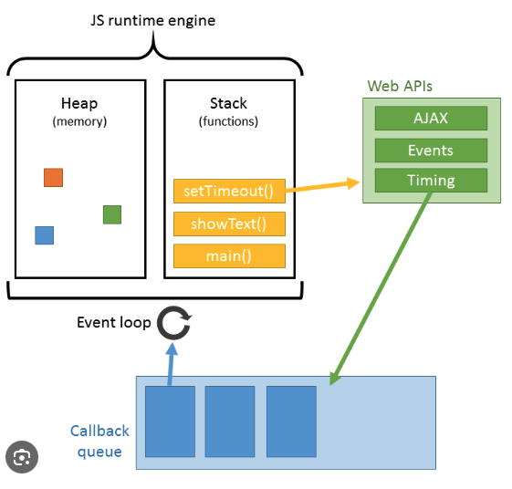

# More advanced topics

## Async JS

- Regular JS is sequentially executed, in order
- However in the real world we want our program to have "pauses", eg network calls, read/write from files (disk), time.sleep() functions, user input
- JS solves async work using the event loop
  - All functions go into the call stack
  - The "event loop" checks if there's anything to be done on the call stack. If there is, the event loop provides it with CPU and memory to do the work.
  - Sometimes the functions can't be executed by the event loop (because a pause is required). So the event gets passed to the execution engine (node/bun/deno/browser)
  - The engine/browser executes the code that javascript cannot (network call/sleep) and then puts the function into a queue (callback queue, or VIP queue)
  - The event loop picks up the function from the queue and continues executing it

Event loop visualized:

## Closures

- These are functions, they remember the environment in which they were created. Useful when creating functions within other functions. The inner function always retains the variables that were defined in the outer function, even across invocations. Check example.

## Promises

Docs: https://developer.mozilla.org/en-US/docs/Web/JavaScript/Reference/Global_Objects/Promise

- This is a way to create async behaviour
- A promise represents the completion of an asynchronous action and its resulting value.
- A promise takes a callback function as argument. The callback function takes 2 arguments, resolve or reject. Either the promise was resolved (successfully completed) or rejected.
- A promise has multiple states: pending, fulfilled, rejected
- 2 aspects to this: promise creation and promise catching
- Promise creation: use the promise constructor, takes a callback function with 2 parameters and returns them with the appropriate message/data
- Promise catching: call the function that returns the promise. Add a `.then()` to catch the case where the promise was fulfilled, and a `.catch()` to handle the case where the promise failed. Both `.then()` and `.catch()` take an anonymous function as arguments. These anonymous functions have access to the data returned by the promise (defined in the Promise constructor). These functions can also return their own data, and multiple `.then()` functions can be chained to each other, each accessing the previous one's output for multi-step processing, this is called promise chaining.
- If you don't catch the promise, i.e just call the promise-returning function without then and catch, it will return a `promise { <pending> }` and block until it completes execution, then the program moves on with execution. The final value of the promise is not caught.

## Prototypal inheritance

- Just inheritance through prototypes
- We can add methods to an object's prototype chain: `Person.prototype.greet = function() { bla bla bla}`
- We can then access these methods when we instantiate an object
- Nothing special
